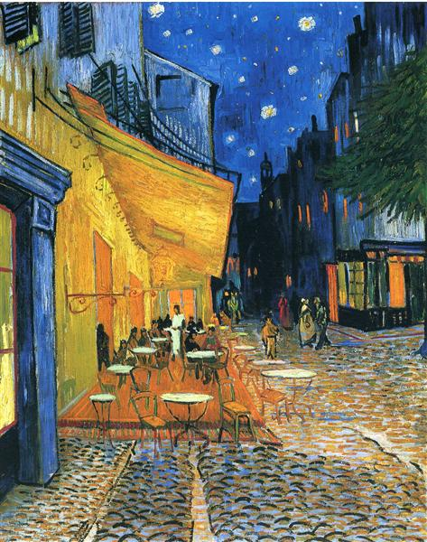
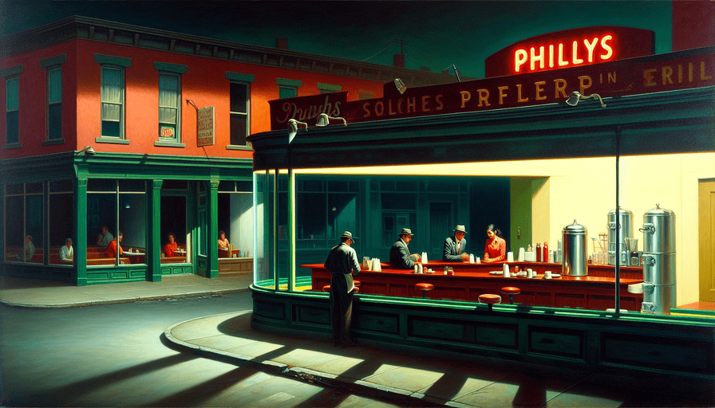
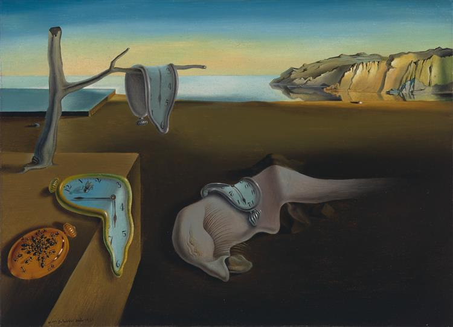

# art-rethinking-ai

**This project uses OpenAI APIs to recreate art masterpieces.**

In particular:
1. given the image of a famous painting (e.g. Mona List), OpenAI APIs return the detailed description of the artwork listing all objects and colors included in the image;
2. this description is reused to ask OpenAI APIs to create a new paiting.

<u>The interesting thing of this project is that the name of the masterpiece and its author are never mentioned.</u>

## Examples

They are some examples of artworks that we have created with this project:

<table>
  <tr>
    <th>ORIGINAL</th>
    <th>NEW</th>
  </tr>
  <tr>
    <td>
      
    </td>
    <td>
      
    </td>
  </tr>
  <tr>
    <td>
      
    </td>
    <td>
      
    </td>
  </tr>
  <tr>
    <td>
      
    </td>
    <td>
      
    </td>
  </tr>
  <tr>
    <td>
      
    </td>
    <td>
      
    </td>
  </tr>
  <tr>
    <td>
      
    </td>
    <td>
      
    </td>
  </tr>
</table>

## Usage

You can try this project locally.

### Requirements

- Node >= 18: you can download it [here](https://nodejs.org/) or using a [Node Version Manager](https://github.com/nvm-sh/nvm);
- an OpenAI account: you can create it [here](https://platform.openai.com/signup);
- at least 5$ in your OpenAI account: you can charge it [here](https://platform.openai.com/settings/organization/billing/overview);
- an OpenAI API key: you can create it [here](https://platform.openai.com/api-keys);

### Get started

Once cloned this repository, install its dependencies:

```
npm i
```

Create a file called `.env.local` in the root folder of the repository, and add your [OpenAI API key](https://platform.openai.com/api-keys) here:

```
NEXT_PUBLIC_OPENAI_API_KEY=(openai-api-key-here)
```

Now you can run the project

```
npm run dev
```

And test it on http://localhost:3000.