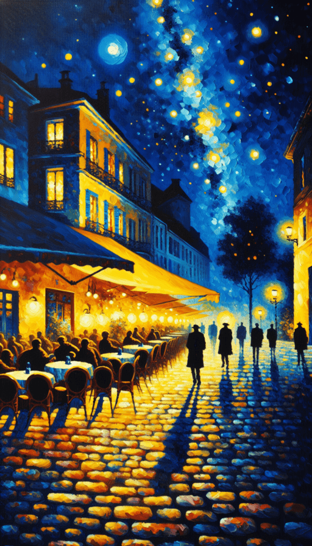
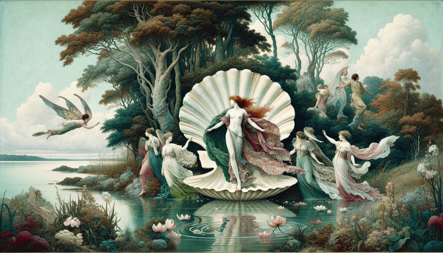
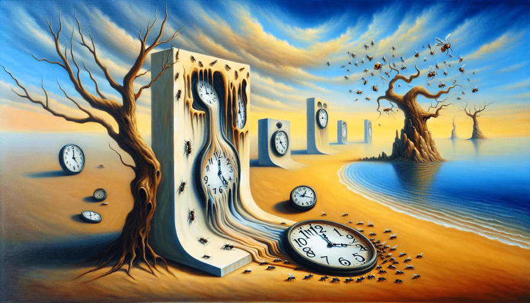

# art-rethinking-ai

**This project utilizes OpenAI's APIs to create unique pieces of art.**

By providing an image of a famous painting (e.g., the Mona Lisa), OpenAI's APIs generate a detailed description of the artwork, including the objects and colors depicted.

Using this description, the project then prompts the OpenAI APIs to produce a new, original painting.

<u>The title and artist of the original masterpiece are intentionally omitted.</u>

This experiment aims to evaluate the AI's ability to analyze and recreate  an image (`image-to-text-to-image`).

## Examples

These are some examples of artworks we have created with this project:

<table>
  <tr>
    <th>ORIGINAL</th>
    <th>NEW</th>
  </tr>
  <tr>
    <td>
      
    </td>
    <td>
      
    </td>
  </tr>
  <tr>
    <td>
      
    </td>
    <td>
      
    </td>
  </tr>
  <tr>
    <td>
      
    </td>
    <td>
      
    </td>
  </tr>
  <tr>
    <td>
      
    </td>
    <td>
      
    </td>
  </tr>
  <tr>
    <td>
      
    </td>
    <td>
      
    </td>
  </tr>
</table>

## Usage

You can try this project locally.

### Requirements

- Node >= 18: you can download it [here](https://nodejs.org/) or using a [Node Version Manager](https://github.com/nvm-sh/nvm);
- an OpenAI's account: you can create it [here](https://platform.openai.com/signup);
- at least 5$ in your OpenAI's wallet: you can charge it [here](https://platform.openai.com/settings/organization/billing/overview);
- an OpenAI API key: you can create it [here](https://platform.openai.com/api-keys);

### Get started

Once cloned this repository, install its dependencies:

```
npm i
```

Create a file called `.env.local` in the root folder of the repository, and add your [OpenAI API key](https://platform.openai.com/api-keys) here:

```
NEXT_PUBLIC_OPENAI_API_KEY=(openai-api-key-here)
```

Now you can run the project

```
npm run dev
```

And test it on http://localhost:3000.

## Contribute

To contribute to this project, you can follow the instructions reported in [Usage](#usage) above.

The technologies used in this projects:
- [OpenAI APIs](https://platform.openai.com/docs/overview);
- [React](https://react.dev/);
- [Next.js by Vercel](https://nextjs.org/);
- [SWR](https://swr.vercel.app/);
- [Materialize CSS](https://materializecss.com/);
- [WikiArt](https://www.wikiart.org/) for paitining images and data;

### TODO

- Add the possibility to search a painting (e.g. using [WikiArt APIs](https://www.wikiart.org/en/App/GetApi));
- improve the UI components (migrate to Bulma?).